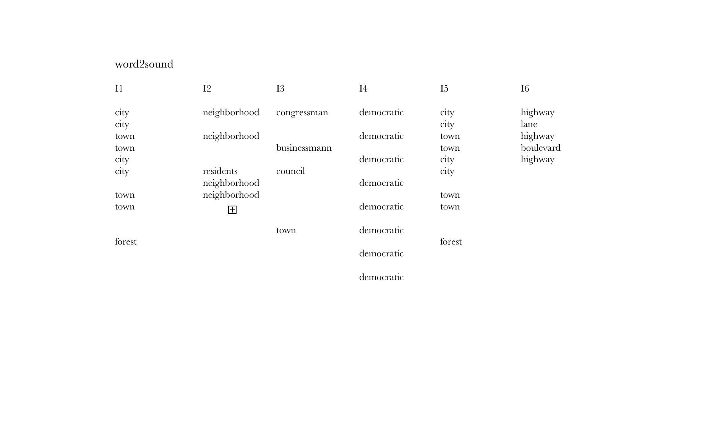

# Score 

Assignment: 
> Envision a piece of music and then symbolically represent it. Your representation should not take the form of staff notation. Instead, devise an alternative representation such as text, graphing or drawing.

## Word2Music

